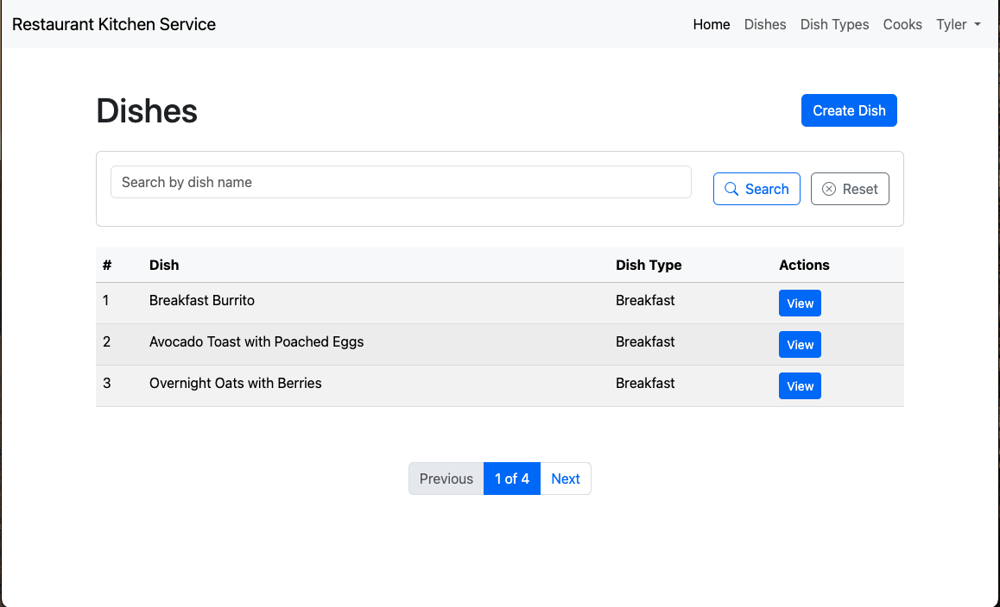

# Restaurant-Kitchen-Service

Django project the purpose of which to function as a simple kitchen management system for cooks.

## Check it out!

https://restaurant-kitchen-service-2895.onrender.com/

## Installing/Developing

Python3 must be already installed.

```shell
git clone https://github.com/tylerj231/Restaurant-Kitchen-Service.git
cd kitchen-service-develop
python3 -m venv venv
source venv/bin/activate
pip install requirements.txt
python manage.py runserver # runs Django Server. Or configure your IDE to run it for you!.
```

## Features

* Django built-in authentication for Cook/User
* Ability to create, update, delete Dishes, Dish Types & Cooks/Users.
* You can assign a specific dish to a specific cook who's qualified enough to prepare it.
* Simple but convenient search for dishes, dish types & cooks of course.

## Demo

